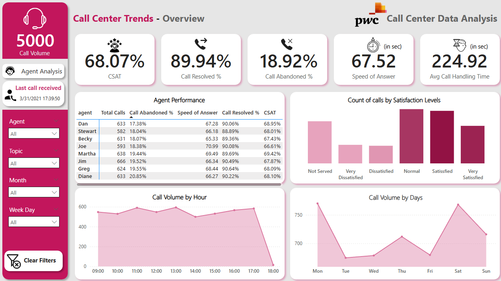

# 📞 PwC Call Center Trends Dashboard

A Power BI dashboard designed to analyze call center operational performance and customer satisfaction metrics. This project provides actionable insights into call volume trends, agent efficiency, and service quality indicators.

---

## 📊 Dashboard Overview

The Call Center Trends Dashboard provides a consolidated operational view of:

- Total Call Volume
- Customer Satisfaction (CSAT)
- Call Resolution Rate
- Call Abandonment Rate
- Speed of Answer (ASA)
- Average Handling Time (AHT)
- Agent-level performance metrics
- Call distribution by day and hour
- Satisfaction-level analysis

This dashboard supports data-driven decision-making for call center managers and operations teams.

---

## 🚀 Key Metrics (KPIs)

| Metric | Description |
|--------|-------------|
| **Call Volume** | Total number of inbound calls received |
| **CSAT (%)** | Customer Satisfaction Score |
| **Call Resolved (%)** | Percentage of calls successfully resolved |
| **Call Abandoned (%)** | Percentage of calls abandoned before resolution |
| **Speed of Answer (sec)** | Average time taken to answer calls |
| **Avg Handling Time (sec)** | Average duration spent handling calls |

---

## 📈 Dashboard Components

### 1️⃣ KPI Summary Cards
High-level performance indicators for quick executive visibility.

### 2️⃣ Agent Performance Analysis
Detailed breakdown per agent including:
- Total Calls
- Abandonment Rate
- Speed of Answer
- Resolution Rate
- CSAT

This enables performance benchmarking and coaching insights.

### 3️⃣ Satisfaction Level Distribution
Call counts categorized into:
- Not Served
- Very Dissatisfied
- Dissatisfied
- Normal
- Satisfied
- Very Satisfied

Helps identify overall customer sentiment trends.

### 4️⃣ Call Volume by Hour
Tracks intraday call distribution (09:00 – 18:00) to support workforce optimization.

### 5️⃣ Call Volume by Day
Identifies peak call days (Monday – Sunday) for improved staffing allocation.

### 6️⃣ Interactive Filters
Dynamic slicers allow filtering by:
- Agent
- Topic
- Month
- Week Day

All visuals update automatically based on filter selections.

---

## 🛠️ Tools & Technologies

- **Power BI Desktop**
- DAX (Data Analysis Expressions)
- Data Modeling & Relationships
- Interactive Visualizations & Slicers

---

## 📷 Dashboard Preview

```markdown

